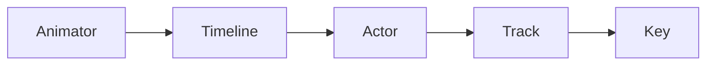
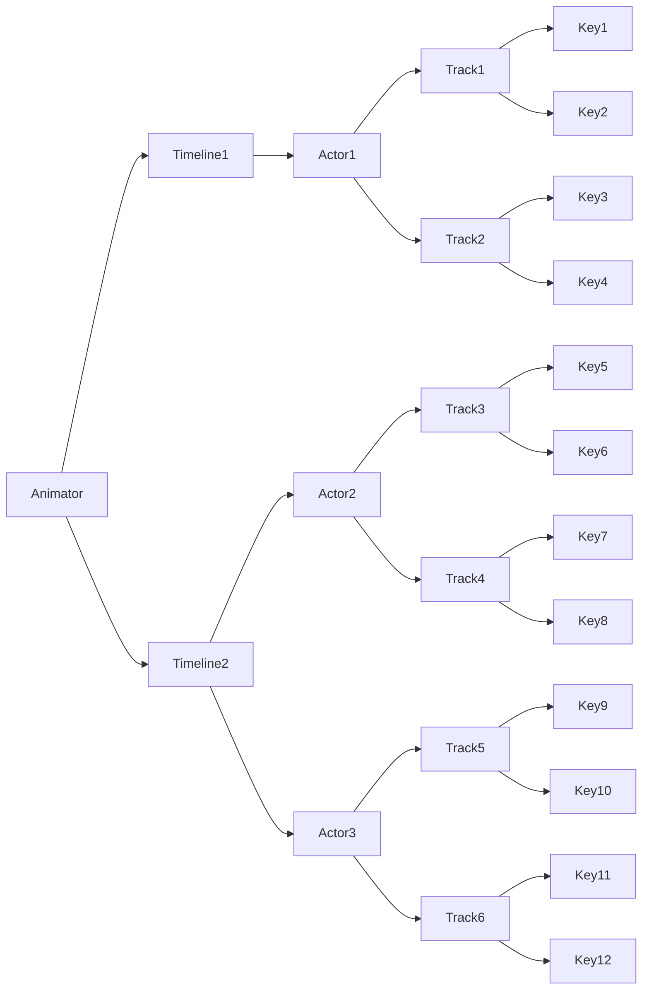

<p align="center"></p >

# Orbit-FX

I put this project together very quickly, to demonstrate how to write a universal key-frame animator for the web &mdash; an animator capable of beautiful, smooth animations, with programmable hooks for user interactions.

## Installation

Use the following commands to start the demo.

```shell
git clone https://github.com/F1LT3R/orbit-fx
cd orbit-fx
npm install
npm start
```

## Demonstration

The following demonstration shows eight animation styles, applied to a group of flex-box elements. In this demonstration, Orbit-FX is used to control the values of the elements' 3D CSS Transforms. Note: Orbit-FX can be used to animate _anything_, by passing a custom handler into the animator.

[Try the demo](https://f1lt3r.github.io/orbit-fx/public/)

[](https://f1lt3r.github.io/orbit-fx/public/)

## Example Usage

This verbose example, demonstrates how to create an Orbit-FX animation. In this example, an absolutely positioned div, is bounced around in a square motion. When the timeline ends, the user is alerted. Upon clicking OK, the animation begins looping forever.

[Try this example](https://f1lt3r.github.io/orbit-fx/public/examples/example-1.html)

```js
import Animation from 'orbit-fx'

const framesPerSecond = 60
const animation = new Animation(framesPerSecond)

const name = 'squareBounce'
const start = 0
const end = 400
const speed = 4
const loop = false

let alertWasSeen = false

const callback = (timeline) => {
    if (!alertWasSeen) {
        alert(`Timeline '${timeline.name}' ended at frame '${timeline.frame}'`)
        alert(`Click 'OK' to loop the animation`)
        alertWasSeen = true
    }

    timeline.frame = 0
    animation.play()
}

const timeline = animation.timeline(name, start, end, speed, loop, callback)

const $div = document.querySelector('#actor')

const handler = {
    left: 100,
    top: 100,

    update: () => {
        $div.style.left = handler.left + 'px'
        $div.style.top = handler.top + 'px'
    },
}

const actorName = 'div'
const easing = 'outBounce'

/* prettier-ignore */
timeline.actor(actorName, handler)
	.track('left')
		.key(0, 100, easing)
		.key(100, 200, easing)
		.key(200, 200, easing)
		.key(300, 100, easing)
	.track('top')
		.key(0, 100, easing)
		.key(100, 100, easing)
		.key(200, 200, easing)
		.key(300, 200, easing)
		.key(400, 100, easing)

animation.load('squareBounce')
animation.play()
```

## Animator Hierarchy

Orbit-FX is constructed with the following hierarchy.



Each animation can have multiple timelines. Each timeline can have muliple actors. Each actor can have multiple tracks. And each track can have multiple keys.

Here is a diagram of a more complex animation, that has two timelines and three actors. An `Actor` is an object that is being animated, a `Track` is a property of an Actor that you want to animate. And a `Key` is a key frame in the animation.

Note: each timeline can be loaded and unloaded individually. You can play timelines together, or independently.



## Animator

The `Animator` is the global controller for a set of timelines, and is instantiated as an `animation`.

```js
import Animator from 'orbit-fx'

const fps = 60
const animation = new Animator(fps)
```

## Timeline

A `Timeline` is a frame-space within which to animate your actors.

```js
const timeline = animation.timeline('name', start, end, speed, loop, callback)
```

### `Callback`

The instantiated `timeline` object is passed into the callback as the first argument.

The callback is never fired while the animation is looping.

```js
const callback = (timeline) => {
    // Alerts the end frame of the animation
    alert(timeline.frame)

    // Play the animation again
    timeline.frame = 0
    animation.play()
}
```

## Actor

Syntax

```js
.actor(name, actorObjectOrHandler)
```

An `Actor` is an object that is animated on your `Timeline`.

The `Animator` will automatically update the animated properties on your Actor's JavaScript object.

```js
const actor = { left: 0, top: 0 }

timeline.actor('name', actor)
```

### Actor Handler

Because Orbit-FX is a Universal Animator, it doesn't know about the properties of your objects. So, if you are animating things like CSS properties, you will need to pass a handler in to account for the correct CSS Units, like `px`, `em` or `%`.

The `Animator` will call the `update` method on your handler, passing in the tracks being animated.

```js
const $actor = document.querySelector('#actor')

const actorHandler = {
    left: 0,
    top: 0,
    update: (tracks) => {
        if (tracks.left) {
            $actor.style.left = actorHandler.left + 'px'
        }

        if (tracks.top) {
            $actor.style.top = actorHandler.top + 'px'
        }
    },
}

timeline.actor('name', actorHandler)
```

### Built-In Handler

Syntax

```js
.actor('actor-name', actorObject)
```

Orbit-FX ships with a built in handler for CSS 3D transforms. It is also capable of handling `opacity` and `backgroundColor` in RGBA color format.

You can import `css3D` to use instead of writing your own handler.

```js
import Animator, { css3D } from 'orbit-fx'

const $actor = document.querySelector('#actor')

timeline.actor('name', css3D($actor))
```

## Track

Syntax

```js
.track(actorPropertyToAnimate)
```

A `Track` represents the frame-space for a given property of an `Actor`. All of the properties of an `Actor` that you wish to animate, will be controlled via their own individual tracks.

```js
import Animator, { css3D } from 'orbit-fx'

const $actor = document.querySelector('#actor')

/* prettier-ignore */
timeline.actor('name', css3D($actor))
	.track('translateX')
	.track('translateY')
```

## Key

Syntax

```js
.key(frame, value, easing)
```

A `Key` represents a key-frame within your `Track`.

A `Key` represents the intended value of a tracked property at given frame.

An `Easing` value is passed in as the last argument of your `Key` frame.

```js
/* prettier-ignore */
timeline.actor('name', css3D($actor))
	.track('translateX')
		.key(0, 0, 'bounceOut')
		.key(100, 0)
	.track('translateY')
		.key(0, 0, 'bounceIn')
		.key(100, 0)
```

## Chaining

Orbit-FX allows chaining of the syntax used to create animations. This helps to produce tighter code, that aids cognition when working with animations that become more complex.

```js
import Animator, { css3D } from 'orbit-fx'

const $actor = document.querySelector('#actor')

/* prettier-ignore */
const animation = new Animator(60)
	.timeline('name', start, end, speed, looping, callback)
		.actor('name', css3D($actor))
			.track('translateX')
				.key(0, 0, 'bounceOut')
				.key(100, 0)
			.track('translateY')
				.key(0, 0, 'bounceIn')
				.key(100, 0)
```

## Easing

> **Easing Demonstration:** Click on the link below for a demonstration of all 32 easing modes combined into a single animation. [Click here to try the easing example](https://f1lt3r.github.io/orbit-fx/public/examples/example-2.html)

Orbit-FX currently supports 32 types of easing. Combining different kinds of easing in your animations allows for some fantastic effects.

The default easing is `linear`, which is used by the animator when you do not pass an easing type into the last argument of your `Key` frame.

If you want the property of an `Actor` to "jump" without interpolation when it reaches a given frame, use the `step` easing type.

### List of Easing Types

- `step`
- `linear`
- `inOutQuad`
- `inQuad`
- `outQuad`
- `inCubic`
- `outCubic`
- `inOutCubic`
- `inQuart`
- `outQuart`
- `inOutQuart`
- `inQuint`
- `outQuint`
- `inOutQuint`
- `inSine`
- `outSine`
- `inOutSine`
- `inExpo`
- `outExpo`
- `inOutExpo`
- `inCirc`
- `outCirc`
- `inOutCirc`
- `inElastic`
- `outElastic`
- `inOutElastic`
- `inBack`
- `outBack`
- `inOutBack`
- `inBounce`
- `outBounce`
- `inOutBounce`
