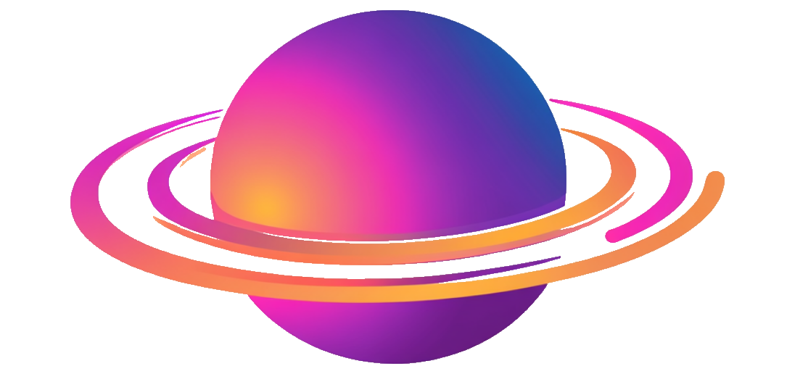
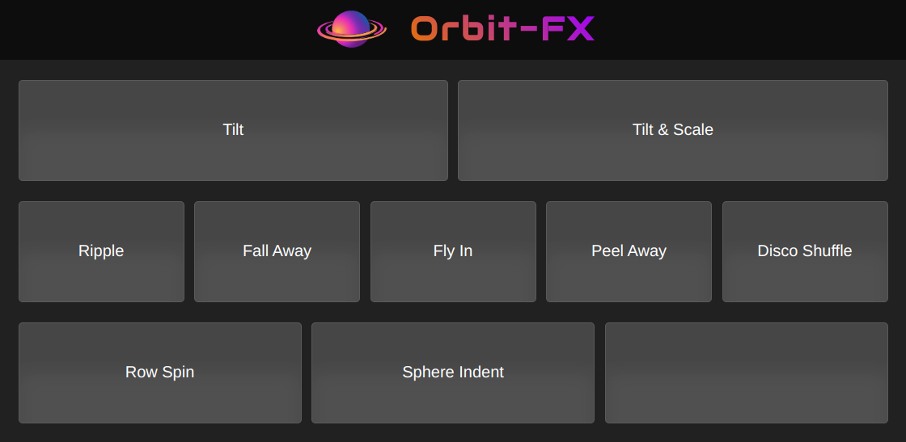

<p align="center"></p >

# Orbit-FX

A quick code example to demonstrate how to write a DOM element animator, to create beautiful, interactive animations with JavaScript and CSS.

## Installation

Use the following commands to start the demo.

```shell
git clone https://github.com/F1LT3R/orbit-fx
cd orbit-fx
npm install
npm start
```

## Demo

The following demonstration shows eight different styles of animation, applied to a group of flex-box elements, using 3D CSS Transforms.

[Try the demo](https://f1lt3r.github.io/orbit-fx/public/)

[](https://f1lt3r.github.io/orbit-fx/public/)

## Usage

This verbose example, demonstrates how to create an Orbit-FX animation. In this example, an absolutely positioned div, is bounced around in a square motion. When the timeline ends, the user is alerted. Upon clicking OK, the animation begins looping forever.

[Try this example](https://f1lt3r.github.io/orbit-fx/public/examples/example-1.html)

```js
import Animation from '../orbit-fx/main.mjs'

const framesPerSecond = 60
const animation = new Animation(framesPerSecond)

const name = 'squareBounce'
const start = 0
const end = 400
const speed = 4
const loop = false

let alertWasSeen = false

const callback = (timeline) => {
    if (!alertWasSeen) {
        alert(`Timeline '${timeline.name}' ended at frame '${timeline.frame}'`)
        alert(`Click 'OK' to loop the animation`)
        alertWasSeen = true
    }

    timeline.frame = 0
    animation.play()
}

const timeline = animation.timeline(name, start, end, speed, loop, callback)

const $div = document.querySelector('#actor')

const handler = {
    left: 100,
    top: 100,

    update: () => {
        $div.style.left = handler.left + 'px'
        $div.style.top = handler.top + 'px'
    },
}

const actorName = 'div'
const easing = 'outBounce'

/* prettier-ignore */
timeline.actor(actorName, handler)
	.track('left')
		.key(0, 100, easing)
		.key(100, 200, easing)
		.key(200, 200, easing)
		.key(300, 100, easing)
	.track('top')
		.key(0, 100, easing)
		.key(100, 100, easing)
		.key(200, 200, easing)
		.key(300, 200, easing)
		.key(400, 100, easing)

animation.load('squareBounce')
animation.play()
```

## Animation

## Easing

Types of Easing

- `step`
- `linear`
- `inOutQuad`
- `inQuad`
- `outQuad`
- `inCubic`
- `outCubic`
- `inOutCubic`
- `inQuart`
- `outQuart`
- `inOutQuart`
- `inQuint`
- `outQuint`
- `inOutQuint`
- `inSine`
- `outSine`
- `inOutSine`
- `inExpo`
- `outExpo`
- `inOutExpo`
- `inCirc`
- `outCirc`
- `inOutCirc`
- `inElastic`
- `outElastic`
- `inOutElastic`
- `inBack`
- `outBack`
- `inOutBack`
- `inBounce`
- `outBounce`
- `inOutBounce`
